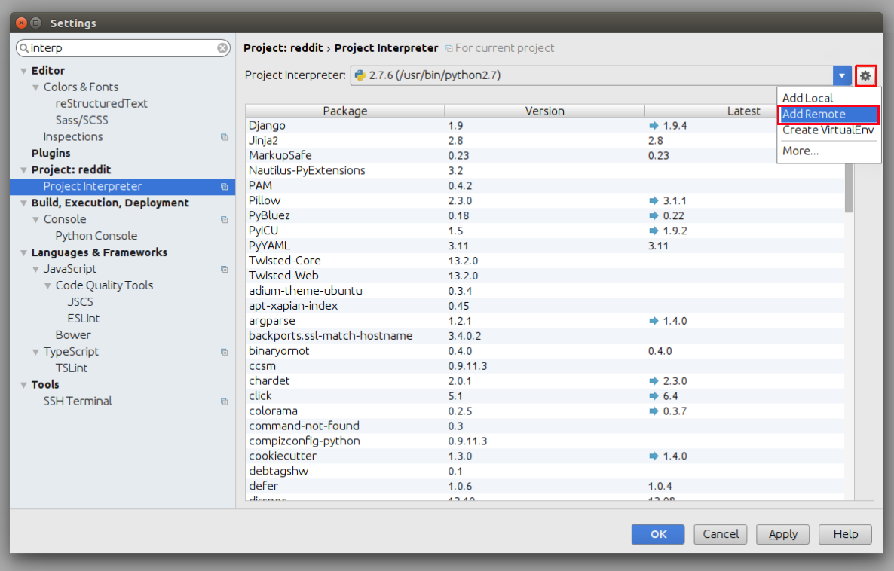
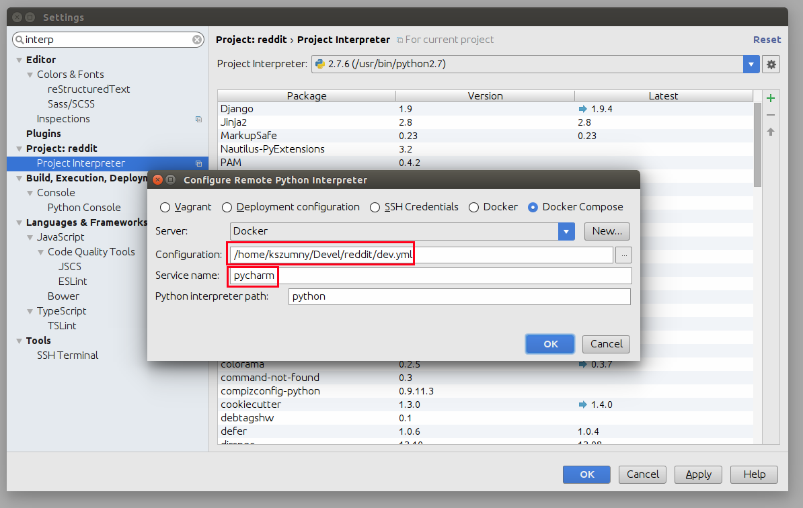
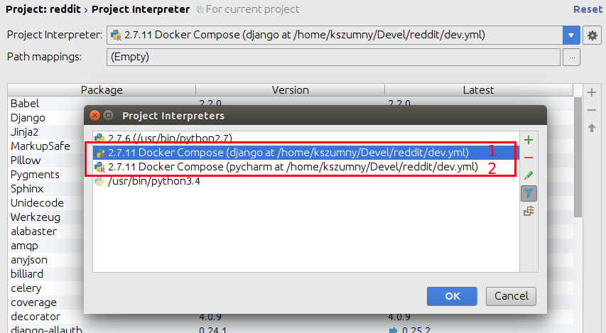

Docker Remote Debugging
=======================

To connect to python remote interpreter inside docker, you have to make
sure first, that Pycharm is aware of your docker.

Go to *Settings &gt; Build, Execution, Deployment &gt; Docker*. If you
are on linux, you can use docker directly using its socket
unix:///var/run/docker.sock, if you are on Windows or Mac, make sure
that you have docker-machine installed, then you can simply *Import
credentials from Docker Machine*.

Configure Remote Python Interpreter
-----------------------------------

This repository comes with already prepared "Run/Debug Configurations"
for docker.

But as you can see, at the beggining there is something wrong with them.
They have red X on django icon, and they cannot be used, withot
configuring remote python interpteter. To do that, you have to go to
*Settings &gt; Build, Execution, Deployment* first.

Next, you have to add new remote python interpreter, based on already
tested deployment settings. Go to *Settings &gt; Project &gt; Project
Interpreter*. Click on the cog icon, and click *Add Remote*.

Switch to *Docker Compose* and select dev.yml file from directory of
your project, next set *Service name* to django

Because Pycharm restarts container every time you use Configuration Run,
to not have server restarted during running tests, we defined second
service in dev.yml file called pycharm. To use it, you have to add
interpreter of second service as well.

The final result should be:

Having that, click *OK*. Close *Settings* panel, and wait few seconds...

After few seconds, all *Run/Debug Configurations* should be ready to
use.

**Things you can do with provided configuration**:

\* run and debug python code .. image:: images/f1.png \* run and debug
tests .. image:: images/f2.png .. image:: images/f3.png \* run and debug
migrations or different django managment commands .. image::
images/f4.png \* and many others..

Known issues
------------

-   Pycharm hangs on "Connecting to Debugger"

This might be fault of your firewall. Take a look on this ticket -
<https://youtrack.jetbrains.com/issue/PY-18913>

-   Modified files in .idea directory

Most of the files from .idea/ were added to .gitignore with a few
exceptions, which were made, to provide "ready to go" configuration.
After adding remote interpreter some of these files are altered by
PyCharm:

In theory you can remove them from repository, but then, other people
will lose a ability to initialize a project from provided configurations
as you did. To get rid of this annoying state, you can run command:

    $ git update-index --assume-unchanged snabb.iml
